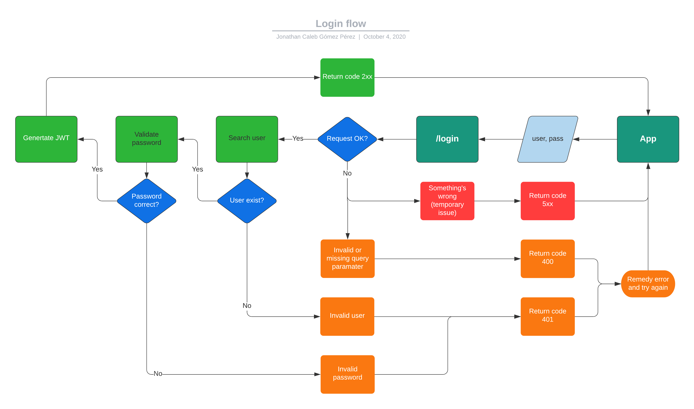

# Auth
> Authentication system

## Usefull information
### Usefull tools
- Postam (or other API Client) for REST calls.

### API schema
| Path             |  Verb  | Description                                 | Auth |
| ---------------- |:------:|:------------------------------------------- |:----:|
| `/`              | `GET`  | Return the next endpoints paths             |  No  |
| `/auth`          | `GET`  | Return auth endpoints paths                 |  No  |
| `/auth/login`    | `POST` | Return an access token for the user         |  No  |
| `/auth/register` | `POST` | Create an user                              |  No  |
| `/users`         | `GET`  | Return all users                            |  Yes |
| `/users/me`      | `GET`  | Return the user information                 |  Yes |
| `/users/me`      | `PUT`  | Update the user information                 |  Yes |
| `/users/me`      |`DELETE`| Delete the user                             |  Yes |

### Auth flow


## Instructions
### A) Run the app
***
This steps are just to prepare the application and to know the code and project structure.
#### **Install dependencies:**
```bash
# Inside of aplication directory
$ npm install
```

#### **Uncomment the marked lines:**
(**Note**: *There are aprox. 22 lines to uncomment*)

Files where are commented lines:
- `src/api/main/index.js` (2 line)
- `src/api/index.js` (2 lines)
- `src/services/express/index.js` (1 lines)
- `src/services/mongoose/index.js` (3 lines)
- `src/config.js` (12 lines)
- `src/app.js` (2 lines)

##### Example for `src/api/main/index.js`:
```js
// A) Uncomment this line:
const MainController = require('./controller');
```

#### **Run the app for verification:**
```bash
# Inside of aplication directory
$ npm run dev
```

### B) Write the code
***
This steps are the real challenge.

#### **ENV configuration**
You will need to add some environment variables.
> **Inv:** How to use dotenv

Create an `.env` file and add this variables:
```js
// For mongo connection
MONGODB_URI=theurlconnection

// For token generation
JWT_SECRET=whateveryouwanttogeneratetoken
TOKEN_EXPIRES_IN=1800 // 1800s = 30min... I think
```

#### **Registration**
- **Connect to mongo:**
  > **Inv:** How to create a cluster on Atlas \
  > **Inv:** How to connect to Atlas

- **User model:**
  > **Inv:** Models on `mongoose` \
  > **Inv:** Model validation on `mongoose` \
  > **Inv:** Timestamp for `mongoose` model
  ```ts
  // User fields

  username: string // required
  password: string // required
  firstname: string // required
  lastname: string // required
  email: string // required
  [Opt] deleted: boolean
  ```
  (**Note**: *On create you need to encrypt the password and on login you need to compare the password*)
  > **Inv:** Pre methods for `mongoose` models \
  > **Inv:** How to use `bcrypt` (`hashSync`) \
  > **Inv:** How to use `bcrypt` (`compareSync`)

- **CRUD endpoints:**
  > **Inv:** Retrieve body parameters from request \
  > **Inv:** Basic CRUD operations with `mongoose` model \
  > **[Opt] Inv:** Request validation (`joi`) \
  > **[Opt] Inv:** Request mapping (`bodymen`)

  Create CRUD operations for User model using the rigth http verb [`GET`, `POST`, `PUT`, `DELETE`]
  
  _(See `src/api/main` for `GET` examples and project organization.)_

#### **Auhtentication**
- **Get username & password from request:**

  (_See CRUD endpoints step for more ideas_).

- **Search the user on database:**

  Search for the user using the username and validate password using the function for comparation on the `pre` functions on the user model.
  
  *If no user found or invalid password send `Unauthorized (401)`* 

  (_See User Model & CRUD endpoints step for more information_).

- **Generate token:**
  > **Inv:** Generate a token using `jsonwebtoken`

  (**Note**: *Only generate token if the user was found and password is valid*)

  ##### Example of how to generate token using `jsonwebtoken`:
  ```js
  const token = jwt.sign({
    username,
    exp: Date.now() + (Number(process.env.TOKEN_EXPIRES_IN) * 60), // 30min from that moment
  }, process.env.SECRET);
  ```

#### **Authorization (middleware)**
> **Inv:** How middleware works
- **Retrive token:**
  
  Get the `Authorization` from request header & extract the token.

  *If no token send `Unauthorized (401)`*

- **Validate token:**
  ##### Example of how to validate token using `jsonwebtoken`:
  ```js
  jwt.verify(token, process.env.SECRET, (err, user) => {
      if (err) {
        // Send Forbidden
      }
      
      // Continue the request
  });
  ```
  *If error on token send `Forbidden (403)`.*
  
  *If no token provided send `Unauthorized (401)`*

#### **Deploy to heroku**
- **Add `start` script on package.json**
- **Create an new app from heroku console**
- **Configure to deploy from GitHub**
- **Push to master/main**

## Expected
**Send a request to your application on `yourapp.herokuapp.com/auth/login` like this:**
```json
{
    "username": "someusername",
    "password": "somepassword"
}
```
**Receive a response like this:**
```json
{
    "access_token": "[some_token_here]",
    "expiresIn": 6251065106
}
```